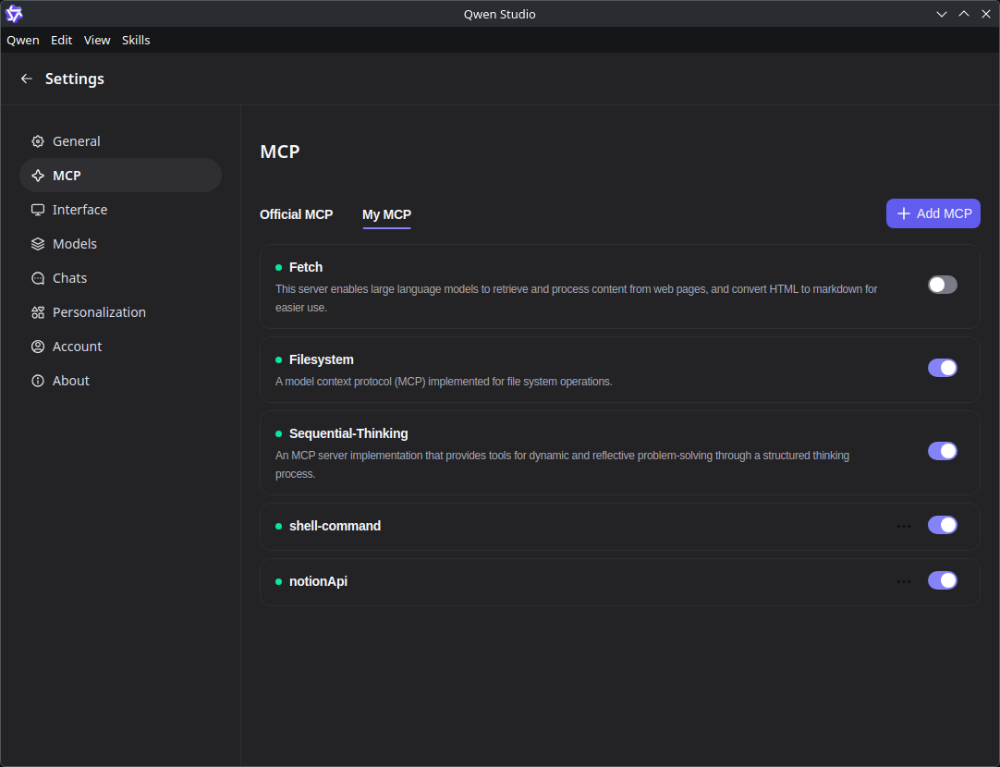
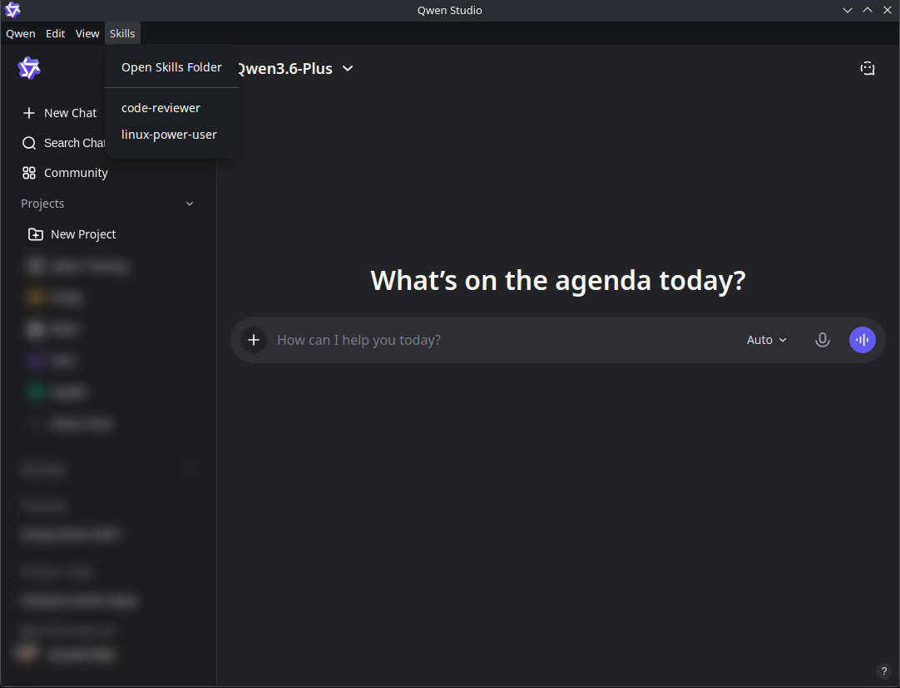

# Qwen Desktop for Linux 🐧 — Free Open-Source Qwen AI Desktop Client

[](https://github.com/youssefvdel/qwen-desktop-linux/releases)
[](LICENSE)
[](https://github.com/youssefvdel/qwen-desktop-linux/releases)
[](https://github.com/youssefvdel/qwen-desktop-linux/stargazers)

**The first and only open-source Qwen AI (Tongyi Qianwen) desktop application for Linux.** Run Alibaba's Qwen3 models natively on Ubuntu, Fedora, Arch, and all Linux distributions with full MCP (Model Context Protocol) support.

> 💡 **What is Qwen?** Qwen (通义千问 / Tongyi Qianwen) is Alibaba Cloud's family of large language models, including Qwen-Max, Qwen-Plus, Qwen3-6Plus, and Qwen3-235B-A22B. The official Qwen Desktop app only supports Windows and macOS — **this project brings the same desktop experience to Linux.**

---

## 🚀 Quick Install — No Building Required

### Option 1: AppImage (Recommended — works on every distro)
```bash
# Download the latest release
wget https://github.com/youssefvdel/qwen-desktop-linux/releases/latest/download/Qwen-1.1.1-x86_64.AppImage
chmod +x Qwen-1.1.1-x86_64.AppImage
./Qwen-1.1.1-x86_64.AppImage
```

### Option 2: Debian/Ubuntu
```bash
wget https://github.com/youssefvdel/qwen-desktop-linux/releases/latest/download/qwen-desktop_1.1.1_amd64.deb
sudo apt install ./qwen-desktop_1.1.1_amd64.deb
qwen-desktop
```

### Option 3: Fedora/RHEL
```bash
sudo dnf install https://github.com/youssefvdel/qwen-desktop-linux/releases/latest/download/qwen-desktop-1.1.1.x86_64.rpm
qwen-desktop
```

**[📦 All Downloads →](https://github.com/youssefvdel/qwen-desktop-linux/releases)**

---

## ✨ Features

| Feature | Description |
|---------|-------------|
| 🤖 **Full Qwen AI Access** | Native desktop wrapper for chat.qwen.ai — supports Qwen3-6Plus, Qwen-Max, Qwen-Plus |
| 🔌 **MCP Integration** | Connect AI to your files, browser, databases, and custom tools via Model Context Protocol |
| 💻 **System Tray** | Minimize to tray, right-click menu, stays running in background |
| 🌍 **12 Languages** | 中文, English, 日本語, 한국어, Русский, Deutsch, Français, Español, Italiano, Português, العربية |
| 🎨 **Theme Support** | Light/dark mode with automatic system theme detection |
| ️ **Privacy First** | Sandboxed webview, context isolation, no data leaks, Electron Fuses security |
| 📦 **3 Package Formats** | AppImage (universal), .deb (Debian/Ubuntu), .rpm (Fedora/RHEL) |
| ⚡ **Bundled Runtimes** | Includes Bun + UV — MCP servers work with zero system installs |
| 🔗 **Deep Linking** | `qwen://` protocol support for authentication and sharing |
| 🧩 **Skills System** | Create reusable system prompts as `.md` files — inject into chat with one click |

---

## 📸 Screenshots

*(Add your screenshots here — Google indexes images and they drive clicks!)*


*Main chat interface with Qwen3-6Plus*


*MCP configuration panel*


*Skills system menu*

---

## ❓ FAQ

### What is Qwen AI?
Qwen (通义千问, Tongyi Qianwen) is a family of large language models developed by Alibaba Cloud's Tongyi Lab. It includes models like Qwen-Max (most capable), Qwen-Plus (balanced), Qwen3-6Plus, and Qwen3-235B-A22B. It's China's answer to GPT-4 and Claude.

### Is this the official Qwen Desktop app?
No. The official Qwen Desktop app from Alibaba only supports **Windows and macOS**. This is a **community-built, open-source** desktop wrapper that brings the same experience to Linux by reverse-engineering the official app's desktop protocol.

### Is Qwen Desktop for Linux free?
Yes, 100% free and open-source under the MIT license. No account needed beyond your Qwen account on chat.qwen.ai.

### What Linux distributions are supported?
All of them. The **AppImage** works on every distro (Ubuntu, Fedora, Arch, Debian, openSUSE, etc.). We also provide native **.deb** packages for Debian/Ubuntu and **.rpm** packages for Fedora/RHEL.

### What is MCP (Model Context Protocol)?
MCP lets Qwen AI interact with your local tools and data. With MCP enabled, Qwen can read/write files on your computer, automate your browser, query databases, and use any CLI tool — all from the chat interface.

### Does it work on Wayland?
Yes, but you may need to add `--enable-features=UseOzonePlatform --ozone-platform=wayland` as a launch flag on some Wayland compositors. On X11, it works out of the box.

### How does this compare to using chat.qwen.ai in a browser?
| Browser | Qwen Desktop for Linux |
|---------|----------------------|
| No system tray | ✅ Minimize to tray |
| No MCP support | ✅ Full MCP (files, browser, databases) |
| No file picker integration | ✅ Native file picker |
| No deep linking | ✅ qwen:// protocol |
| No offline skills | ✅ Skills system with .md files |
| Browser tabs clutter | ✅ Dedicated app window |

### Can I build from source?
Yes! See the [Development](#-development) section below.

---

## 🏗️ Architecture

Built with **Electron 34** + **TypeScript**, mirroring the official Qwen Desktop app's architecture:

```
┌─────────────────────────────────────────────┐
│           Qwen Desktop (Electron)            │
│                                              │
│  ┌─────────────┐    ┌──────────────────┐    │
│  │ Main Process│    │   MCP Proxy      │    │
│  │             │◄──►│  (McpProxy)      │    │
│  │  - IPC      │    │  - stdio client  │    │
│  │  - Tray     │    │  - SSE client    │    │
│  │  - Menu     │    │  - HTTP stream   │    │
│  └──────┬──────┘    └────────┬─────────┘    │
│         │                    │               │
│  ┌──────▼──────┐    ┌───────▼──────────┐    │
│  │  Preload    │    │  Bundled Runtimes│    │
│  │  (Bridge)   │    │  - bun           │    │
│  │             │    │  - uv / uvx      │    │
│  └──────┬──────┘    └──────────────────┘    │
│         │                                    │
│  ┌──────▼──────────────────────────────┐    │
│  │         WebView                      │    │
│  │   chat.qwen.ai (desktop detection)   │    │
│  │   window.electronAPI exposed         │    │
│  └──────────────────────────────────────┘    │
└─────────────────────────────────────────────┘
```

### Module Structure (after 2026-04 refactor)

| Module | Purpose |
|--------|---------|
| `src/main/index.ts` | App bootstrap, MCP defaults, menu, update check |
| `src/main/window-manager.ts` | BrowserWindow, system tray, GPU flags |
| `src/main/ipc-handlers.ts` | 17 IPC handlers (MCP, theme, dialogs) |
| `src/main/skills-manager.ts` | Skills system (inject prompts into chat) |
| `src/main/app-lifecycle.ts` | Protocol handler, deep links, quit state |
| `src/main/runtime.ts` | Bundled bun/uv path resolution |
| `src/main/mcp-config.ts` | MCP config adaptation (npx→bun, uvx→uvx) |
| `src/mcp/proxy.ts` | Multi-server MCP connection management |
| `src/mcp/server-client.ts` | Single MCP server client (stdio/SSE/HTTP) |
| `src/preload/index.ts` | contextBridge → window.electronAPI |

---

## 🛠️ Development

### Prerequisites
- Node.js 22+
- npm
- Linux (x64 or ARM64)

### Install & Run
```bash
git clone https://github.com/youssefvdel/qwen-desktop-linux.git
cd qwen-desktop-linux
npm install    # Downloads bun + uv runtimes automatically
npm start      # Development mode with hot reload
```

### Build Packages
```bash
# AppImage (universal portable app)
npm run build

# All formats (AppImage + deb + rpm)
npm run make

# Individual formats
npm run make:deb    # Debian/Ubuntu
npm run make:rpm    # Fedora/RHEL
```

### Project Structure
```
qwen-desktop-linux/
├── src/
│   ├── main/           # Electron main process
│   │   ├── index.ts    # App bootstrap
│   │   ├── window-manager.ts
│   │   ├── ipc-handlers.ts
│   │   ├── skills-manager.ts
│   │   ├── app-lifecycle.ts
│   │   ├── runtime.ts
│   │   └── mcp-config.ts
│   ├── mcp/            # MCP implementation
│   │   ├── proxy.ts
│   │   └── server-client.ts
│   ├── preload/        # Preload script (bridge)
│   │   └── index.ts
│   ├── renderer/       # Minimal webview shell
│   └── shared/         # TypeScript types
├── resources/          # Bundled runtimes + icon
│   ├── bun/linux-x64/
│   └── uv/linux-x64/
├── dist/               # Build output
└── package.json
```

---

## 🔧 MCP Configuration

### What Can MCP Do?

| MCP Server | Capability |
|-----------|------------|
| **Filesystem** | Read, write, search, list files on your computer |
| **Fetch** | Access web APIs and URLs directly from chat |
| **Sequential-Thinking** | Multi-step reasoning for complex problems |
| **Desktop-Commander** | Run shell commands, manage processes |
| **Browser** | Automate web browsing, take screenshots (Playwright) |
| **SQLite/PostgreSQL** | Query databases directly from chat |

### Example MCP Config
The app creates default MCP servers on first launch. Customize via the app's settings:

```json
{
  "Filesystem": {
    "command": "bun",
    "args": ["x", "-y", "@modelcontextprotocol/server-filesystem", "/home/user/Documents"],
    "transportType": "stdio"
  },
  "Fetch": {
    "command": "bun",
    "args": ["x", "-y", "@modelcontextprotocol/server-fetch"],
    "transportType": "stdio"
  },
  "Browser": {
    "command": "uvx",
    "args": ["@anthropic/mcp-server-playwright"],
    "transportType": "stdio"
  }
}
```

**Note:** The app automatically replaces `npx`, `bun`, and `uvx` commands with bundled runtime paths — no system-wide installs needed.

---

## 🧩 Skills System

Create reusable system prompts as `.md` files in `~/.config/qwen-desktop-linux/skills/`. Each skill is injected into the chat input with one click from the **Skills** menu.

### Example Skill
```markdown
# Python Expert

You are a senior Python developer. Focus on:
- PEP8 compliance and type hints
- Performance optimization
- Error handling and testing
- Modern Python 3.12+ features
```

Click **Menu → Skills → Python Expert** to inject this prompt before chatting.

### Built-in Skills
- `linux-power-user.md` — Linux terminal commands and system administration
- `code-reviewer.md` — Code review with scoring and improvement suggestions
- `python-expert.md` — Python development guidance (sample)

---

## 🌐 Internationalization

Supported languages:
- 🇨🇳 简体中文 (zh-CN)
- 🇬🇧 English (en-US)
- 🇹🇼 繁體中文 (zh-TW)
- 🇯🇵 日本語 (ja-JP)
- 🇰🇷 한국어 (ko-KR)
- 🇷🇺 Русский (ru-RU)
- 🇩 Deutsch (de-DE)
- 🇫 Français (fr-FR)
- 🇪 Español (es-ES)
- 🇮 Italiano (it-IT)
- 🇵 Português (pt-PT)
- 🇧 العربية (ar-BH)

---

## 🔒 Security

| Layer | Implementation |
|-------|---------------|
| **Context Isolation** | Renderer has no direct Node.js access |
| **Sandbox** | WebView runs in isolated process |
| **Electron Fuses** | Dangerous features disabled in production |
| **IPC Only** | All communication through typed channels |
| **MCP Validation** | Only configured servers can connect |
| **No Telemetry** | Zero data collection or tracking |

---

## 📋 Known Issues

| Issue | Status | Workaround |
|-------|--------|-----------|
| Auto-update not configured | Planned | Use package manager or download new release |
| Wayland compositors | Partial | Add `--ozone-platform=wayland` flag |
| AppImage needs FUSE | Distro-dependent | Install `libfuse2` (Debian) or `fuse` (Arch) |

---

## 🤝 Contributing

Contributions welcome! This is a **community project** to bring Qwen Desktop to Linux.

1. **Fork** the repository
2. **Create** a feature branch (`git checkout -b feature/amazing-feature`)
3. **Commit** your changes (`git commit -m 'Add amazing feature'`)
4. **Push** to the branch (`git push origin feature/amazing-feature`)
5. **Open** a Pull Request

### What We Need
- 🌐 Translations for additional languages
- 🐛 Bug reports and fixes
- 📖 Documentation improvements
- 🎨 UI/UX enhancements
- 🧪 Testing on different distros

---

## 📜 License

**MIT License** — free for personal and commercial use. See [LICENSE](LICENSE) for details.

---

## 🙏 Acknowledgments

- Based on reverse engineering of the official **Qwen Desktop** app (Windows/macOS)
- Uses [`@modelcontextprotocol/sdk`](https://github.com/modelcontextprotocol/typescript-sdk) by Anthropic
- Bundled runtimes: [Bun](https://bun.sh/) + [uv](https://github.com/astral-sh/uv)
- Built with [Electron](https://www.electronjs.org/)

---

**Made with ❤️ for the Linux community**

**Keywords:** Qwen AI Linux, Qwen Desktop Linux, Tongyi Qianwen Linux, open source Qwen, free Qwen AI desktop, Alibaba Qwen Linux client, Qwen MCP Linux, Qwen3 Linux app, Qwen chat desktop Linux, Ubuntu Qwen AI, Fedora Qwen, Arch Linux Qwen, Electron Qwen app
